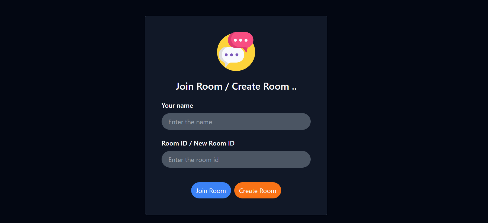

<h1 align="center">Chat Application (Learning project)</h1>

A real-time full-stack chat application built with **Spring Boot**, **WebSockets**, **React**, and **Mongodb** — featuring JWT authentication, Redux state management, and modular Java MVC architecture.

---

## 🛠️ Tech Stack

### 🔹 Backend

  
  
  
  
  

### 🔹 Frontend

  
  
  

### 🔹 Database & Tools

  
  
  

---

## 🚀 Features

- 🧠 **Create custom chat groups**
- 🧑‍🤝‍🧑 **Join existing communities**
- 💬 **Real-time messaging** powered by WebSockets
- 🔐 **Secure login** with JWT tokens
- 🌐 **Built using Java MVC + React + MongoDB**
- ⚛️ **Frontend state management with Redux**
- 🎨 **Styled with TailwindCSS for modern UI**

---

## 🖼️ Screenshots

